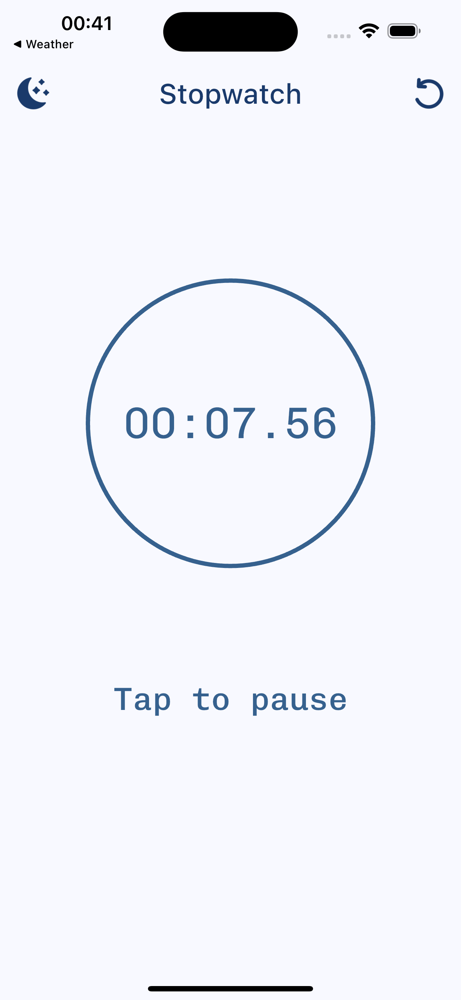
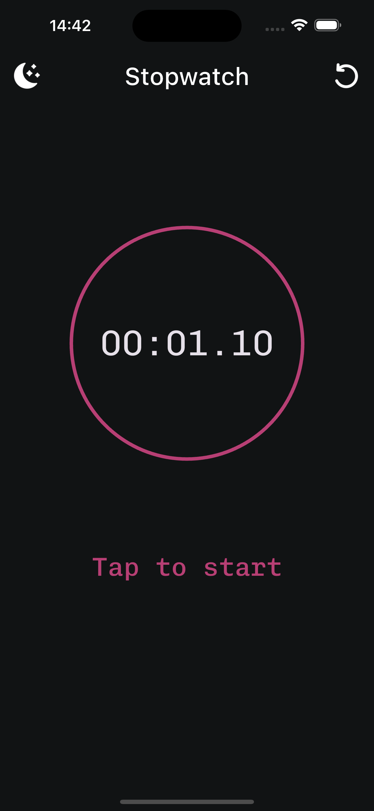

# Simple stopwatch.

A simple and minimalistic stopwatch app built with Flutter.

## Main features

 1. Dark and Light themes 
 2. Run by tap on the screen

## Screenshots

| Light Theme | Dark Theme |
|-------------|------------|
|  |  |

